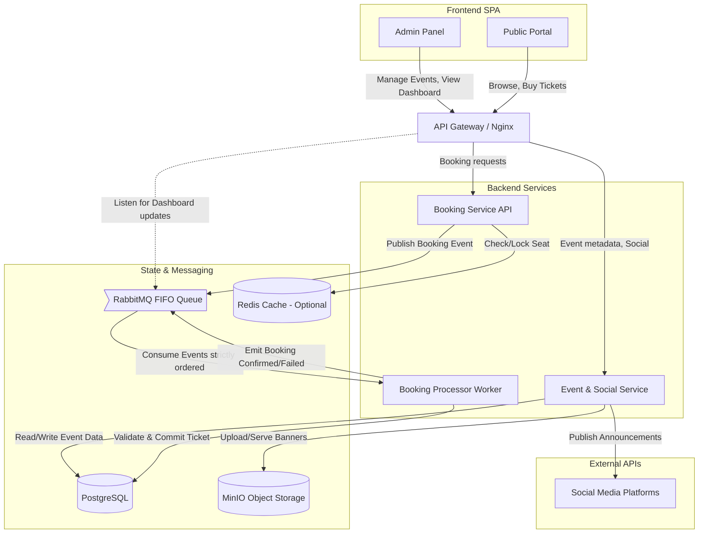

# Event-Driven Ticketing System Architecture

Designing a ticketing system requires strict consistency for seat allocations while maintaining high availability under sudden load spikes. Containerizing this locally gives you a perfect sandbox to test those event-driven workflows before scaling them to a resilient multi-regional cloud deployment.

## Architecture Diagram



## 1. Core Containerized Components

To run this entirely on your local machine, we can emulate enterprise-grade infrastructure using open-source Docker images.

- **Frontend (Nginx / React or Vue):** A Single Page Application (SPA) container serving two distinct areas:
  - **Admin Panel:** Protected via JWT authentication. Admins can create events, upload media, view the real-time sales dashboard, and trigger social media posts.
  - **Public Portal:** Open access for browsing events, viewing seat maps, and adding tickets to the cart.
- **API Gateway (Kong or Nginx):** Acts as the single entry point, routing requests to the appropriate backend microservices and handling cross-cutting concerns like rate limiting.
- **Event & Social Service (Node.js / Python / Go):** Manages event metadata (title, dates, pricing, seat maps). It also securely holds OAuth tokens for social media APIs (Twitter, Facebook) to publish announcements when an admin publishes an event.
- **Booking Service (Backend API):** Receives the initial booking request from the user, performs basic validation, and pushes the payload onto the message queue.
- **Booking Processor (Worker Service):** The core of the event-driven system. It subscribes to the FIFO queue, processes seat reservations one by one to prevent race conditions, and writes the final confirmation to the database.
- **Database (PostgreSQL):** A persistent relational database is critical here for ACID compliance. It ensures that seat transactions are completely isolated and consistent.
- **Message Broker (RabbitMQ):** Handles the FIFO (First-In, First-Out) queuing. RabbitMQ is lightweight for local Docker setups and handles strict message ordering effortlessly.
- **Object Storage (MinIO):** An S3-compatible local storage container. It will store the event banners and media, ensuring your local code will seamlessly translate to cloud object storage later.
- **In-Memory Cache (Redis) - _Optional but Recommended_:** Used for placing a temporary "hold" on a seat (e.g., a 5-minute lock) while the user completes their checkout form, before the final transaction goes to the queue.

## 2. The Event-Driven FIFO Booking Flow

The most critical part of this architecture is handling concurrent requests for the exact same seat. Here is how the event loop operates:

1.  **Seat Hold:** A user selects Seat A1. The system attempts to place a temporary lock in Redis. If successful, the UI allows them to proceed to purchase.
2.  **Queue Entry:** The user submits their payment/booking request. The Booking Service wraps this data (User ID, Event ID, Seat A1) into a message and publishes it to the RabbitMQ **FIFO Queue**. The frontend immediately receives a "Processing" status via a WebSockets connection or long-polling.
3.  **Sequential Processing:** The Booking Processor worker reads messages from the queue strictly in the order they arrived.
4.  **Availability Check & Commit:** For each message, the worker runs a database transaction:
    - _Check:_ Is Seat A1 still marked 'available' in PostgreSQL?
    - _Update:_ If yes, mark 'booked', assign to User ID, and emit a `BookingConfirmed` event.
    - _Failure:_ If the seat was somehow already committed (e.g., temporary lock expired and someone else grabbed it), emit a `BookingFailed` event.
5.  **Dashboard Update:** The Admin Dashboard listens for `BookingConfirmed` events to increment the real-time sales metrics without needing to continuously poll the database.

## 3. Docker Compose Structure

Your `docker-compose.yml` will orchestrate this environment. A high-level layout looks like this:

```yaml
version: "3.8"
services:
  gateway:
    image: nginx:latest
    ports: ["8080:80"]
  frontend:
    build: ./frontend
  event-service:
    build: ./event-service
  booking-service:
    build: ./booking-service
  booking-worker:
    build: ./booking-worker
  postgres-db:
    image: postgres:15
    volumes: ["pgdata:/var/lib/postgresql/data"]
  rabbitmq:
    image: rabbitmq:3-management
    ports: ["5672:5672", "15672:15672"]
  minio:
    image: minio/minio
    command: server /data
    ports: ["9000:9000", "9001:9001"]
    volumes: ["miniodata:/data"]
  redis:
    image: redis:alpine
```
